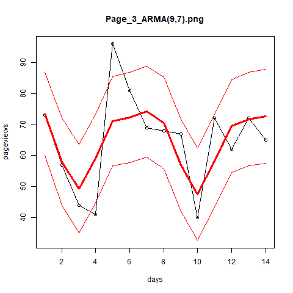
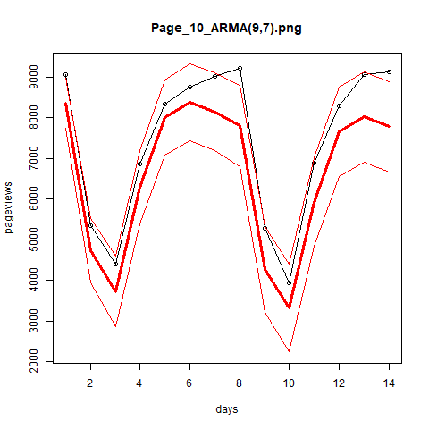
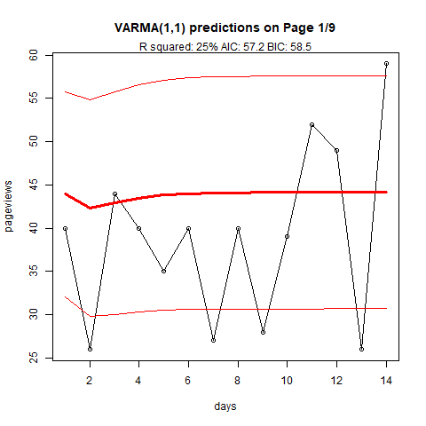
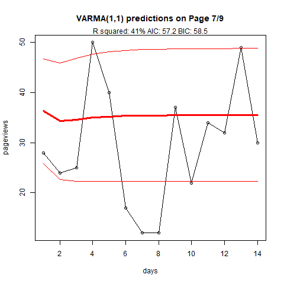
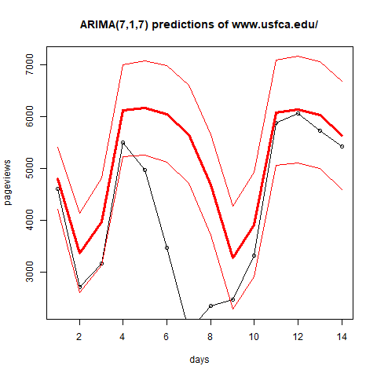

<link rel="stylesheet" type="text/css" href="./style/style.css">

This project explores a dataset of 795 rows x 10 columns. Each column is a webpage on <a href="www.usfca.edu/">University of San Francisco's Marketing Site</a>. The 10 highest activity pages were chosen to avoid sparsity. Each row contains the daily count of pageviews for that each of these 10 webpages. The complete data set represents about 26 months of activity.

In order of activity, the pages studied in this project are:
<ol>
<li><a href="http://www.usfca.edu/">USF's Homepage</a></li>
<li><a href="http://www.usfca.edu/arts-sciences/undergraduate-programs">Arts & Sciences Undergrad Programs</a></li>
<li><a href="http://www.usfca.edu/arts-sciences/undergraduate-programs/computer-science">Undergrad Computer Science</a></li>
<li><a href="http://www.usfca.edu/arts-sciences/undergraduate-programs/biology">Undergrad Biology</a></li>
<li><a href="http://www.usfca.edu/arts-sciences">Arts & Sciences Homepage</a></li>
<li><a href="http://www.usfca.edu/arts-sciences/undergraduate-programs/art-architecture/design">Design Major</a></li>
<li><a href="http://www.usfca.edu/arts-sciences/undergraduate-programs/data-science">Undergrad Data Science</a> (represent!)</li>
<li><a href="http://www.usfca.edu/arts-sciences/undergraduate-programs/media-studies">Media Studies</a></li>
<li><a href="http://www.usfca.edu/arts-sciences/undergraduate-programs/communication-studies">Communication Studies</a></li>
<li><a href="http://www.usfca.edu/arts-sciences/undergraduate-programs/dual-degree-teacher-preparation">Dual Degree Teacher Prep</a></li>
</ol>

I have one main question: <b>Can we predict tomorrows pageviews with higher accuracy if we know the activity of other pages?</b>

This project has several parts:

<ol>
<li>Fetch data updates using Google drive API</li>
<li>Read and Write from a database</li>
<li>Automated analysis of several time series models: ARMA, VARMA, VARIMA, SARIMA</li>
<li>Run this software on a Raspberry Pi</li>
</ol>

The "automated analysis" here is a proof of concept instead of a useful product. This code could be adapted to provide close to real-time reporting or more practical model fitting.

```{r setup, include=FALSE}
library(googledrive)
library(RMySQL)
library(reshape2)
library(magrittr)
library(vars)
library(MTS)
library(gplots)
library(beepr)
library(gridExtra)

output.plots <- FALSE

end.train.data <- 780
```


#### 1. Connect to Google Drive
```{r googleDrive}
data.folder.id <- "1CakyziIpT39meYk05QaBNNEQf4aoWtXh"

#if you don't have permission, stop the script
tryCatch({
  data.folder <- drive_get(as_id(data.folder.id))
},error=function(e){
  print(e)
  drive_deauth()
  stop()
})

file.tibble <- drive_ls(data.folder)


for (key in file.tibble$id){
  tryCatch({
    setwd("./data")
    drive_download(as_id(key)) #download files to localhost
  },error=function(e){
    #do nothing
  })
}

#read files from localhost

data <- read.csv(file.tibble[1,"name"] %>% as.character())
if (nrow(file.tibble) > 1){
  for (filename in file.tibble[2:nrow(file.tibble),"name"] %>% unlist()) {
    data <- rbind(data,read.csv(filename)) #concatenate files
  }
}
names(data) <- c("Page","Date","Pageviews","Unique Pageviews","Avg Time on Page","Entrances","Bounce Rate","Percent Exit","Page Value")
data <- as.data.frame(data)
```

#### 2. Import data to database
```{r intoDatabase}
database <- dbConnect(MySQL(), user='root', password='MyNewPass', dbname='senior_project', host='localhost')

dbWriteTable(database,name="webtraf",data,append=TRUE,row.names=FALSE)
```

```{r fetchFromDatabase, include=FALSE}
dbSendQuery(database, 'SELECT * FROM webtraf;') #any SQL statement works here!

request <- dbListResults(database)[[1]]

#n = -1 asks the server to send all pending requests
web.traffic.data <- fetch(request,n=-1)
web.traffic.data <- web.traffic.data[!duplicated(web.traffic.data),]
```

# Analysis

## ARMA

To select the ideal parameters for the ARMA model, I fit models on a lag of anywhere between 1 and 14 days for both parameters. The prediction error of each of these models produced a heatmap. I focus on just 4 pages to compare ARMA and VARMA.

From left to right, top to bottom:

<table>
<tr><th>Page</th><th>Content</th></tr>
<tr><td>Page 1</td><td> Undergrad Data Science</td></tr>
<tr><td>Page 3</td><td> Undergrad Computer Science</td></tr>
<tr><td>Page 7</td><td> Communication Studies</td></tr>
<tr><td>Page 10</td><td> USF's Homepage</td></tr>
</table>

The heatmaps look generally the same, with higher sparsity seemingly related to a higher chance of a failed model fit.
```{r fitARMA, include=FALSE}
#will use string of page url for index
unique.pages <- web.traffic.data$Page %>% unique()
unique.pages <- unique.pages[!unique.pages==""]
  
tryCatch({
  setwd("./rds")
   fit.armas.grid.search <- readRDS("fitARMAsGridSearch.rds")
},error=function(e){
  
  fit.armas.grid.search <- list()
  
  #compute SSE for p=1:14 x q=1:14
  startTime <- Sys.time()
  scaled <- list()
  for (i in 1:length(unique.pages)) {
    time.series <- web.traffic.data[which(web.traffic.data$Page == unique.pages[[i]]),"Pageviews"]
    train <- time.series[1:end.train.data]
    
    fit.armas <- list()
    for (p in 0:14) {
      for (q in 0:14) {
        tryCatch({
          scaled[[14*p + q + 1]] <- FALSE
          fit.armas[[14*p + q + 1]] <- arima(train,c(p,0,q))
        }, error = function(e){
          #the model fit could fail for several reasons. Computing the covariance matrix for large values can fail, so scaling the input avoids that problem. It's also possible there is a large scale trend (which this model wouldnt account for because d = 1). This is avoided by setting method = maximum likelihood. A failure to converge may also be solved with some extra iterations.
          tryCatch({
            fit.armas[[14*p + q + 1]] <- arima(train/1000,c(p,0,q),method="ML",optim.control=list(maxit=1000))
          },error=function(e){
            print(paste("ARMA fit failed for",i,p,q,sep=" "))
          })
          scaled[[14*p + q + 1]] <- TRUE
        })
        
      }
    }
    percentComplete <- i/10
    runningTime <- Sys.time() - startTime
    estimateOfTotalTime <- runningTime/percentComplete
    
    estimatedFinishTime <- startTime + estimateOfTotalTime
        
    print(paste("Start:",startTime,"Est. duration:",estimateOfTotalTime,"Est. finish time:",estimatedFinishTime,i,p,q,sep=" "))
    fit.armas.grid.search[[i]] <- fit.armas
    rm(fit.armas)
  }
  saveRDS(fit.armas.grid.search,"fitARMAsGridSearch.rds")
})
```

```{r aFewManualARMAs, include = FALSE}
p <- 9
q <- 7

i <- 8

time.series <- web.traffic.data[which(web.traffic.data$Page == unique.pages[[i]]),"Pageviews"]
train <- time.series[1:end.train.data]
test <- time.series[(end.train.data+1):length(time.series)]

fit.armas.grid.search[[i]][[14*p + q + 1]] <- arima(train,order=c(p,0,q),method="ML")

#

i <- 9

time.series <- web.traffic.data[which(web.traffic.data$Page == unique.pages[[i]]),"Pageviews"]
train <- time.series[1:end.train.data]
test <- time.series[(end.train.data+1):length(time.series)]

fit.armas.grid.search[[i]][[14*p + q + 1]] <- arima(train,order=c(p,0,q),method="ML")

#

i <- 10

time.series <- web.traffic.data[which(web.traffic.data$Page == unique.pages[[i]]),"Pageviews"]
train <- time.series[1:end.train.data]
test <- time.series[(end.train.data+1):length(time.series)]

fit.armas.grid.search[[i]][[14*p + q + 1]] <- arima(train,order=c(p,0,q),method="CSS")
```

```{r ARMApredictions, include=FALSE}
time.series <- list()
train.data <- list()
test.data <- list()
for (i in 1:length(unique.pages)) {
  time.series[[i]] <- web.traffic.data[which(web.traffic.data$Page == unique.pages[[i]]),"Pageviews"]
  train.data[[i]] <- time.series[[i]][1:end.train.data]
  test.data[[i]] <- time.series[[i]][(end.train.data+1):(time.series[[i]] %>% length())]
}

arma.preds <- list()
for (i in 1:length(unique.pages)) {
  grid.of.preds <- list()
  for (p in 1:14) {
    for (q in 1:14) {
      tryCatch({
        grid.of.preds[[14*p + q + 1]] <- predict(fit.armas.grid.search[[i]][[14*p + q + 1]],newdata=test.data[[i]],n.ahead=14)
      },error=function(e){
        #print(paste(i,p,q))
      })
      
    }
  }
  arma.preds[[i]] <- grid.of.preds
  rm(grid.of.preds)
}
```

```{r evaluateRootSumSquaredResiduals, include=FALSE}
page.grid.of.rssr <- list()
for (i in 1:length(unique.pages)) {
  rssr <- matrix(nrow=14,ncol=14)
  for (p in 1:14){
    for(q in 1:14) {
      tryCatch({
        if(is.null(arma.preds[[i]][[14*p + q + 1]])) {
          rssr[p,q] <- NA
        }else{
          rssr[p,q] <- arma.preds[[i]][[14*p + q + 1]]$se %>% sum() %>% sqrt()
        }
        
      },error=function(e){
        rssr[p,q] <- NA
      })
        #rssr[p,q] <- .Machine$integer.max
    }
  }
  page.grid.of.rssr[[i]] <- rssr
  rm(rssr)
}

page.min.rssr <- list()
indices.of.optimal <- list()
for (i in 1:length(unique.pages)){
  page.min.rssr[[i]] <- page.grid.of.rssr[[i]][!is.na(page.grid.of.rssr[[i]])] %>% unlist() %>% min()
  indices.of.optimal[[i]] <- which(page.grid.of.rssr[[i]] %>% unlist() == page.min.rssr[[i]])
}

optimal.parameters <- list()
for (i in 1:length(unique.pages)){
  optimal.parameters[[i]] <- c(floor(indices.of.optimal[[1]]/14),indices.of.optimal[[i]] %% 14)
}

setwd("./img/ARMA_SSE_Heatmaps")
heatmaps <- list()
for(i in 1:length(unique.pages)){
  page.grid.of.rssr[[i]][is.na(page.grid.of.rssr[[i]])] <- .Machine$integer.max
  page.grid.of.rssr[[i]] <- page.grid.of.rssr[[i]] - (page.grid.of.rssr[[i]] %>% min())
  page.grid.of.rssr[[i]][page.grid.of.rssr[[i]]==max(page.grid.of.rssr[[i]])] <- (sort(page.grid.of.rssr[[1]]) %>% unique())[[(sort(page.grid.of.rssr[[1]]) %>% unique() %>% length()) - 1]]
  
  png(paste("SSE of ARMA(p,q) on Page ",i,".png",sep=""))
  curr.heatmap <- heatmap.2(page.grid.of.rssr[[i]],Rowv=FALSE,Colv=FALSE,tracecol = NA)
  title("ARMA(p,q) Sum of Squared Residuals")
  text(.55,.82,unique.pages[[i]])
  text(.4,.95,paste("Optimal Model: ARMA(",paste(optimal.parameters[[i]],collapse=","),")",sep=""))
  heatmaps[[i]] <- curr.heatmap
  dev.off()
}
```

<table>
<tr>
  <td>
    <a href="./img/ARMA_SSE_Heatmaps/SSE of ARMA(p,q) on Page 1.png" target="_blank"></td><td></a>
  </td>
  <td>
    <a href="./img/ARMA_SSE_Heatmaps/SSE of ARMA(p,q) on Page 3.png" target="_blank"></td><td></a>
  </td>
</tr>
<tr>
  <td>
      <a href="./img/ARMA_SSE_Heatmaps/SSE of ARMA(p,q) on Page 7.png" target="_blank"></td><td></a>
    </td>
    <td>
      <a href="./img/ARMA_SSE_Heatmaps/SSE of ARMA(p,q) on Page 10.png" target="_blank"></td><td></a>
  </td>
</tr>
</table>

<a href="./pages/arma-heatmaps.html">Click here for more heatmaps.</a>

```{r plotPredictions, include=FALSE}
if (output.plots){
  setwd("./img/ARMAPredictionPlots")
  #readline("Would you like to ")
  for (i in 1:length(unique.pages)) {
    for (p in 1:14) {
      for (q in 1:14) {
        
        tryCatch({
          if (is.null(arma.preds[[i]][[14*p + q + 1]]$pred)){
          next
        }
        },error=function(e){
          print(paste(i,p,q))
        })
        
        
        tryCatch({
          predictions <- arma.preds[[i]][[14*p + q + 1]]$pred
          lower.bounds <- predictions - arma.preds[[i]][[14*p + q + 1]]$se
          upper.bounds <- predictions + arma.preds[[i]][[14*p + q + 1]]$se
          days <- 1:length(test.data[[i]])
          pageviews <- test.data[[i]][1:length(test.data[[i]])]
          
          plot.y.lb <- c(pageviews,lower.bounds) %>% min()
          plot.y.ub <- c(pageviews,upper.bounds) %>% max()
          
          title <- paste("Page_",i,"_ARMA(",p,",",q,").png",sep="")
          print(title)
          png(title)
     
          plot(days,pageviews,ylim=c(plot.y.lb,plot.y.ub))
          lines(days,pageviews)
          title(title)
          
          lines(days,predictions,col="red",lwd=3)
          lines(days,lower.bounds,col="red") #lower bound
          lines(days,upper.bounds,col="red") #upper bound
        },error=function(e){
          print(paste(i,p,q))
          plot.new()
          tryCatch({(
            next
          )},error=function(e){
            #tried to next on last iteration. safe to ignore
          })
        })
        dev.off()
      }
    }
  }
}
```
These 10 ARMA models achieved their peak predicitve ability where p = 9. There was less agreement on the moving average portion, but q = 7 is the only one that came up twice. For modeling these pages in general, I would move forward with ARMA(9,7). The following plots are predictions using ARMA(9,7).

<table>
<tr>
  <td>
    <a href="./img/ARMAPredictionPlots/Page_1_ARMA(9,7).png" target="_blank"></td><td></a>
  </td>
  <td>
    <a href="./img/ARMAPredictionPlots/Page_3_ARMA(9,7).png" target="_blank"></td><td></a>
  </td>
</tr>
<tr>
  <td>
    <a href="./img/ARMAPredictionPlots/Page_7_ARMA(9,7).png" target="_blank"></td><td></a>
  </td>
    <td>
    <a href="./img/ARMAPredictionPlots/Page_10_ARMA(9,7).png" target="_blank"></td><td></a>
  </td>
</tr>
</table>


```{r var, include=FALSE}

unique.dates <- unique(web.traffic.data$Date) %>% sort()

vector.form.data <- matrix(nrow=length(unique.dates),ncol=length(unique.pages))
for(k in 1:length(unique.dates)) {
  relevant.rows <- web.traffic.data[which(web.traffic.data$Date == unique.dates[[k]]),]
  
  for(i in 1:length(unique.pages)) {
    vector.form.data[k,i] <- relevant.rows[which(relevant.rows$Page == unique.pages[[i]]),"Pageviews"]
  }
  #vector.form.data[k,i+1] <- unique.dates[[k]]
}

vector.form.data <- apply(vector.form.data,2,as.numeric)

opt.var <- VARselect(vector.form.data[,1:10],lag.max = 14)


tryCatch({
  setwd("./rds")
  readRDS("varFit.rds")
}, error = function(e){
  #var.fit <- VARMA(vector.form.data[,1:10],p=8,q=0)
  
})
vector.form.data <-cbind(vector.form.data,unique.dates) %>% as.data.frame()

vector.form.data <- apply(vector.form.data[,1:10],2,as.character)
vector.form.data <- apply(vector.form.data,2,as.numeric)
```

## VARMA

The VARMA model has many more parameters than ARMA. Accordingly, it requires many more degrees of freedom to fit. I fit a the smallest choice VARMA(p=1,q=1) to the data.

```{r fitvarma, include=FALSE}
varma.train <- vector.form.data[1:end.train.data,]
varma.test <- vector.form.data[(end.train.data+1):nrow(vector.form.data),]
varma.test <- apply(varma.test,2,as.character)
varma.test <- apply(varma.test,2,as.numeric)

tryCatch({
  setwd("./rds")
  varma.fit <- readRDS("varmaFit.rds")
},error=function(e){
  varma.fit <- VARMA(varma.train,p=1,q=1)
  saveRDS(varma.fit,"varmaFit.rds")
})
beep(1)
```

```{r testNullHypotheses, include=FALSE}
parameter.estimates <- varma.fit$coef
estimate.ses <- varma.fit$secoef

reject.null.hypotheses <- abs(parameter.estimates) > (estimate.ses * 1.96) #HT param = 0 @ 95% significance
reject.null.hypotheses[is.na(reject.null.hypotheses)] <- FALSE
reject.null.hypotheses[reject.null.hypotheses] <- 1
reject.null.hypotheses[!reject.null.hypotheses] <- 0

not.reject.null.hypotheses <- reject.null.hypotheses
not.reject.null.hypotheses[which(reject.null.hypotheses == 1)] <- 0
not.reject.null.hypotheses[which(reject.null.hypotheses == 0)] <- 1

heatmap.2(not.reject.null.hypotheses,Rowv=FALSE,Colv=FALSE)
title("Statistically Significant VARMA(1,1) Parameters")
```

```{r visualizePredictions, include=FALSE}
varma.pred <- VARMApred(varma.fit,h=14)
if(output.plots){
  setwd("./img/VARMAplots")
  
  for(page.index in 1:(ncol(varma.train)-1)){
    png(paste("varma",page.index,".png",sep=""))
    
    predictions <- varma.pred$pred[,page.index]
    upper.bound <- predictions + varma.pred$se[,page.index]
    lower.bound <- predictions - varma.pred$se[,page.index]
    
    y.plot.upper.bound <- c(varma.test[,page.index],upper.bound) %>% max()
    y.plot.lower.bound <- c(varma.test[,page.index],lower.bound) %>% min()
    
    days <- 1:nrow(varma.test)
    pageviews <- varma.test[,page.index] %>% as.character() %>% as.numeric()
    
    plot(days,pageviews,ylim=c(y.plot.lower.bound,y.plot.upper.bound))
    lines(days,pageviews) # test data
    
    lines(days,upper.bound,col="red",lwd=1) #predictions
    lines(days,predictions,col="red",lwd=3)
    lines(days,lower.bound,col="red",lwd=1)
    
    title(paste("VARMA(",varma.fit$ARorder,",",varma.fit$MAorder,") predictions on Page ",page.index,"/",ncol(varma.train)-1,sep=""))
  
    observed.data <- varma.fit$data[2:nrow(varma.fit$data),page.index]
    residuals <- varma.fit$residuals[,page.index]
    
    SSE <- (residuals ** 2) %>% sum()
    TSS <- ((observed.data - mean(observed.data)) ** 2) %>% sum()
    
    varma.R.squared <- paste((1 - SSE/TSS) %>% as.character() %>% substr(3,4),"%",sep="")
    varma.AIC <- varma.fit$aic %>% as.character() %>% substr(0,4)
    varma.BIC <- varma.fit$bic %>% as.character() %>% substr(0,4)
    
    mtext(paste("R squared:",varma.R.squared,"AIC:",varma.AIC,"BIC:",varma.BIC))
    dev.off()
  }
}
```

<table>
<tr>
  <td>
    <a href="./img/VARMAplots/varma1.png" target="_blank"></td><td></a>
  </td>
  <td>
    <a href="./img/VARMAplots/varma3.png" target="_blank"></td><td></a>
  </td>
</tr>
<tr>
  <td>
      <a href="./img/VARMAplots/varma7.png" target="_blank"></td><td></a>
    </td>
    <td>
      <a href="./img/VARMAplots/varma10.png" target="_blank"></td><td></a>
  </td>
</tr>
</table>

<a href="./pages/varma-plots.html">Click here for more prediction plots.</a>

## Comparing ARMA and VARMA

```{r printSSETable, include = FALSE}
p <- 9
q <- 7

time.series <- list()
train.data <- list()
test.data <- list()

arma.SSE <- list()

for (i in 1:length(unique.pages)) {
  time.series[[i]] <- web.traffic.data[which(web.traffic.data$Page == unique.pages[[i]]),"Pageviews"]
  test.data[[i]] <- time.series[[i]][(end.train.data+1):length(time.series[[i]])]
  arma.SSE[[i]] <- (test.data[[i]] - arma.preds[[i]][[14*p + q + 1]]$pred)**2 %>% sum()
}

varma.SSE <- list()
for (i in 1:length(unique.pages)) {
  varma.SSE[[i]] <- (varma.pred$pred[,i] - test.data[[i]]) ** 2 %>% sum()
}

arma.better.than.varma <- (arma.SSE %>% unlist()) < (varma.SSE %>% unlist())
arma.better.than.varma

#VARMA was better than ARMA on predicting two weeks out for page 5 only. This is likely a fluke.

single.day.test <- c(test.data[[1]][[1]],test.data[[2]][[1]],test.data[[3]][[1]],test.data[[4]][[1]],test.data[[5]][[1]],test.data[[6]][[1]],test.data[[7]][[1]],test.data[[8]][[1]],test.data[[9]][[1]],test.data[[10]][[1]])

single.day.pred.arma <- c(arma.preds[[1]][[14*p + q + 1]]$pred[[1]],arma.preds[[2]][[14*p + q + 1]]$pred[[1]],arma.preds[[3]][[14*p + q + 1]]$pred[[1]],arma.preds[[4]][[14*p + q + 1]]$pred[[1]],arma.preds[[5]][[14*p + q + 1]]$pred[[1]],arma.preds[[6]][[14*p + q + 1]]$pred[[1]],arma.preds[[7]][[14*p + q + 1]]$pred[[1]],arma.preds[[8]][[14*p + q + 1]]$pred[[1]],arma.preds[[9]][[14*p + q + 1]]$pred[[1]],arma.preds[[10]][[14*p + q + 1]]$pred[[1]])

single.day.pred.varma <- varma.pred$pred[1,]

arma.resid <- single.day.pred.arma - single.day.test
varma.resid <- single.day.pred.varma - single.day.test

arma.single.day.SSE <- (arma.resid ** 2) %>% sum()
varma.single.day.SSE <- (varma.resid ** 2) %>% sum()

arma.better.than.varma.single.day <- arma.single.day.SSE < varma.single.day.SSE
arma.better.than.varma.single.day
```

ARMA outperformed VARMA on 9/10 pages for two-week predictions. The same was true for 1-day predictions. It is tempting to answer our motivating question with a <b>no</b>, but VARMA has ARMA nested inside of it, so in principal VARMA has at least equal, and very likely a greater predictive capability. My main takeaway from these results is not the superiority of ARMA, but the difficulty in fitting and obtaining enough data for VARMA.

## ARIMA

```{r arima, include=FALSE}
homepage.data <- web.traffic.data[which(web.traffic.data$Page=="www.usfca.edu/"),]
homepage.data <- homepage.data[order(homepage.data$Date),]
  
homepage.train <- homepage.data[1:(nrow(homepage.data)-14),"Pageviews"]
homepage.test <- homepage.data[(nrow(homepage.data)-13):(nrow(homepage.data)),"Pageviews"]

tryCatch({
  setwd("./rds")
  optimal.model <- readRDS("homepageArimaFit.rds")
},error=function(e){

  
  #fit for optimal parameters with d = 1
  min.aic <- 9999999999
  optimal.model <- NA
  for (p in 1:14) {
    for (q in 1:14) {
      tryCatch({
        arima.fit <- arima(homepage.train,order=c(p,1,q))
        if(arima.fit$aic < min.aic) {
          min.aic <- arima.fit$aic
          optimal.model <- arima.fit
        }
      },error=function(e){
        beep(7)
      })
    }
    beep(2)
  }
  beep(8)
  saveRDS(optimal.model,"homepageArimaFit.rds")
})

```

```{r plotARIMApredictions, include=FALSE}
homepage.predictions <- predict(optimal.model,newdata=homepage.test,n.ahead=14)

lower.bounds <- homepage.predictions$pred - homepage.predictions$se
upper.bounds <- homepage.predictions$pred + homepage.predictions$se

ylim.lb <- c(homepage.test,lower.bounds) %>% min()
ylim.ub <- c(homepage.test,upper.bounds) %>% max()

days <- 1:length(homepage.predictions$pred)
pageviews <- homepage.test

if(output.plots){
  setwd("./img")
  png("homePagePredictions.png")
  plot(days,pageviews,ylim=c(ylim.lb,ylim.ub))
  lines(1:length(homepage.predictions$pred),homepage.test)
  lines(1:length(homepage.predictions$pred),homepage.predictions$pred,col="red",lwd=3)
  lines(1:length(homepage.predictions$pred),lower.bounds,col="red")
  lines(1:length(homepage.predictions$pred),upper.bounds,col="red")
  
  
  p <- optimal.model$model$phi %>% length()
  q <- optimal.model$model$theta %>% length()
  d <- optimal.model$model$Delta
  title(paste("ARIMA(",p,",",d,",",q,") predictions of www.usfca.edu/",sep=""))
  dev.off()
}

```

Below are ARIMA predictions for www.usfca.edu/

<div style="text-align: center;"><a href="./img/homePagePredictions.png" target="_blank"></a></div>


## SARIMA

```{r fitSARIMA, include=FALSE}
tryCatch({
  setwd("./rds")
  monthly.sarima.fit <- readRDS("monthlySarimaFit.rds")
},error=function(e){
  monthly.sarima.fit <- arima(homepage.train,seasonal=list(order=c(7,1,7),period=28))
  saveRDS(monthly.sarima.fit,"monthlySarimaFit.rds")
})
```

```{r plotSARIMApredictions, include=FALSE}
sarima.predictions <- predict(monthly.sarima.fit,newdata=homepage.test,n.ahead=14)

lower.bound <- sarima.predictions$pred - sarima.predictions$se
upper.bound <- sarima.predictions$pred + sarima.predictions$se

ylim.ub <- c(upper.bound,sarima.predictions$pred) %>% max()
ylim.lb <- c(lower.bound,sarima.predictions$pred) %>% min()

days <- 1:length(sarima.predictions$pred)
pageviews <- homepage.test

setwd("./img")
png("SARIMAPredictions.png")
plot(days,pageviews,ylim=c(ylim.lb,ylim.ub))
lines(1:length(sarima.predictions$pred),homepage.test)
lines(1:length(sarima.predictions$pred),sarima.predictions$pred,col="red",lwd=3)
lines(1:length(sarima.predictions$pred),lower.bound,col="red")
lines(1:length(sarima.predictions$pred),upper.bound,col="red")

title(paste("SARIMA(7,1,7,period = 28) predictions of www.usfca.edu/",sep=""))
dev.off()
```

Below are ARIMA predictions for www.usfca.edu/

<div style="text-align: center;"><a href="./img/SARIMAPredictions.png" target="_blank"></a></div>


## Comparing ARIMA and SARIMA

```{r printSSETableHomepage, include = FALSE}

arima.errors <- homepage.predictions$pred - homepage.test
arima.SSE <- (arima.errors)**2 %>% sum()
sarima.errors <- sarima.predictions$pred - homepage.test
sarima.SSE <- (sarima.errors) ** 2 %>% sum()

days <- 1:length(homepage.test)
pageviews <- homepage.test

setwd("./img/")
png("compareARIMAandSARIMA.png")
plot(days,pageviews)
lines(1:length(homepage.test),homepage.test)
lines(1:length(homepage.test),homepage.predictions$pred,col="blue")
lines(1:length(homepage.test),sarima.predictions$pred,col="green")

title("VARIMA (blue) vs. SARIMA (green)")
dev.off()

sarima.better.than.arima <- sarima.SSE < arima.SSE
sarima.better.than.arima
```

The 28-day period SARIMA performs significantly better than ARIMA.

<div style="text-align: center;"><a href="./img/compareARIMAandSARIMA.png" target="_blank"></a></div>

```{r finishedSuccessfully, include=FALSE}
beep(3)
```
  
# Final Notes

ARMA outperformed VARMA on both 2-week and 1-day predictions. VARMA requires much more data to get a fit.

SARIMA outperformed ARIMA with a 4-week period, which is not surprising.

I originally intended to do a year-over-year model for SARIMA, but the maximum period arima can support is 350. <a href="https://robjhyndman.com/hyndsight/longseasonality/">This article</a> suggested using a Fourier series approach to overcome this limitation.